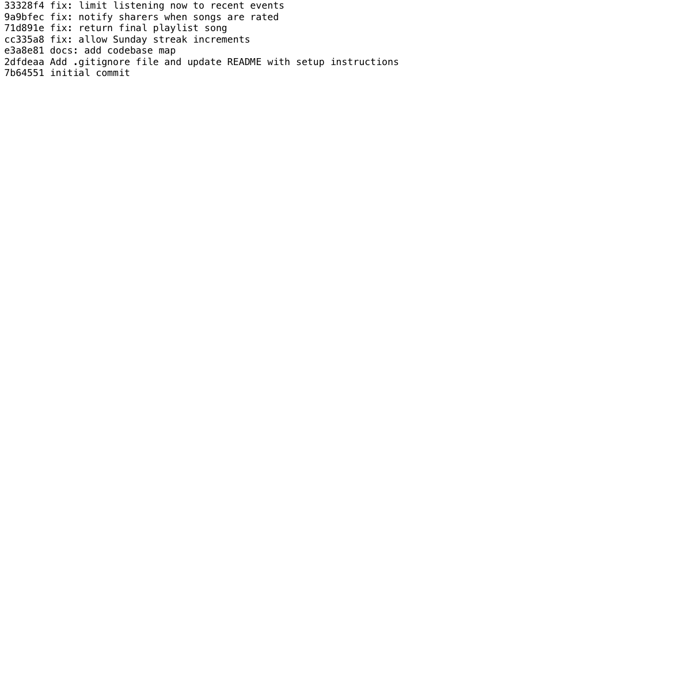

# Mixtape Bug Hunt Submission

## AI Usage

I used Codex to help navigate the unfamiliar Flask codebase, summarize the responsibilities of the route and service modules, and trace route-to-service flows before making changes. I also used it to run the test suite, compare failing test output with the service code, and draft root cause analysis notes while the code paths were fresh. I verified each diagnosis against the source files and test results before applying fixes.

The most useful AI help was during orientation: I asked it to explain the model relationships, association tables, and route-to-service call chains in plain language, then checked those explanations against the source files myself. During debugging, I used AI to reason about edge cases like Python's `datetime.weekday()` return values and to compare the working playlist notification flow with the missing rating-notification flow. One place I had to verify rather than trust the AI was Issue 3: the search query looks suspicious because it joins through `song_tags`, but the existing `tests/test_search.py` passed in this SQLAlchemy version, so I did not count that issue as a fixed bug.

## Submission Checklist

- Branch: `bugfix/mixtape`
- Fixed bugs: Issues 1, 2, 4, and 5
- Stretch coverage: fixed a fourth bug and added regression tests for notification and feed behavior
- Test command: `.venv/bin/python -m pytest tests/`
- Final test result: 16 tests passed
- Git log screenshot: `artifacts/git-log-screenshot.png`



## Codebase Map

### Main Files and Roles

- `app.py` creates the Flask application, configures SQLAlchemy, registers the route blueprints, and creates database tables inside the app context.
- `models.py` defines the data model: `User`, `Song`, `Tag`, `ListeningEvent`, `Rating`, `Playlist`, and `Notification`. It also defines many-to-many association tables for friendships, song tags, and ordered playlist entries.
- `routes/songs.py` handles song search, song detail, rating, and listening endpoints. It parses request data and delegates work to `search_service`, `notification_service`, and `streak_service`.
- `routes/playlists.py` handles playlist creation, playlist metadata, playlist song retrieval, and adding songs to playlists. Playlist song additions go through `notification_service.add_to_playlist()` because that action may notify a song sharer.
- `routes/users.py` handles user profiles, streak lookup, notification retrieval, and marking notifications as read.
- `routes/feed.py` handles friends-listening-now and activity-feed endpoints.
- `services/streak_service.py` records listening events and updates a user's listening streak.
- `services/feed_service.py` builds the friends listening now feed and the general activity feed from `ListeningEvent` rows.
- `services/search_service.py` searches songs and retrieves individual song records.
- `services/notification_service.py` creates notifications, handles rating writes, adds songs to playlists, retrieves notifications, and marks notifications as read.
- `services/playlist_service.py` creates playlists and retrieves playlist metadata or ordered playlist songs.
- `seed_data.py` resets and populates the database with users, friendships, songs, tags, listening events, playlists, playlist entries, ratings, and notifications for manual testing.
- `tests/` contains focused pytest tests for streak, search, and playlist behavior.

### Data Flow: Rating a Song

`POST /songs/<song_id>/rate` enters `routes/songs.py`. The route reads `user_id` and `score` from JSON, validates that both were provided, and calls `notification_service.rate_song(user_id, song_id, score)`. The service validates the score range, loads the `Song` and `User`, checks whether that user already has a `Rating` row for the song, then either updates the existing row or inserts a new `Rating`. After the fix for Issue 4, the same service also creates a `Notification` for the original song sharer when a different user rates their song.

### Pattern Noticed

Routes mostly do HTTP-specific work: parse request fields, call one service function, and format JSON responses. Business rules live in `services/`, while persistence details live in `models.py` and SQLAlchemy queries. Some service functions commit directly, so side effects such as creating a notification need to be handled deliberately in the same service path that performs the user action.

The app also uses a consistent serialization pattern: models expose `to_dict()` methods, and routes return those dictionaries through `jsonify()`. Many-to-many relationships are represented with association tables: `friendships` connects users to friends, `song_tags` connects songs to tags, and `playlist_entries` connects playlists to songs while also storing ordering and audit fields like `position`, `added_by`, and `added_at`.

## Root Cause Analyses

### Issue 1: My Listening Streak Keeps Resetting

**How I reproduced it:** I ran the existing streak tests with `.venv/bin/python -m pytest tests/`. `test_streak_increments_on_sunday` created a user, recorded a Saturday listen, then recorded a Sunday listen. The streak stayed at `1` instead of increasing to `2`.

**How I found the root cause:** I traced `POST /songs/<song_id>/listen` in `routes/songs.py` to `services/streak_service.record_listening_event()`, then into `update_listening_streak()`. The failing test pointed at the Saturday-to-Sunday boundary, and the key line was the `days_since_last == 1 and today.weekday() != 6` condition.

**The root cause:** The service correctly calculated that Saturday to Sunday is a one-day gap, but then excluded Sundays from the consecutive-day increment path. Python's `weekday()` returns `6` for Sunday, so a valid consecutive listen on Sunday fell into the reset branch and set the streak back to `1`.

**Your fix and side-effect check:** I changed the condition so every `days_since_last == 1` case increments the streak. The existing same-day and skipped-day branches still handle duplicate listens and missed days separately, so Monday-to-Tuesday increments and Monday-to-Wednesday resets remain unchanged. I verified this with the streak test file.

### Issue 5: The Last Song in a Playlist Never Shows Up

**How I reproduced it:** I ran `.venv/bin/python -m pytest tests/test_playlists.py`. The test fixture created a playlist with five ordered songs, but `get_playlist_songs()` returned only four titles: `Track 1` through `Track 4`.

**How I found the root cause:** I traced `GET /playlists/<playlist_id>/songs` from `routes/playlists.py` to `services/playlist_service.get_playlist_songs()`. The SQLAlchemy query joined `Song` through `playlist_entries`, filtered by playlist id, and ordered by `position`, which matched the data model. The suspicious part was the final list comprehension slicing `songs[:-1]`.

**The root cause:** The query returned all playlist rows in the correct order, but the service intentionally converted only `songs[:-1]` to dictionaries. In Python, `[:-1]` means every item except the last one, so the final playlist entry was removed for every non-empty playlist.

**Your fix and side-effect check:** I changed the return statement to iterate over `songs` instead of `songs[:-1]`. This preserves the existing ordering query and keeps empty playlists returning an empty list. I verified this with the playlist tests, including the order and empty-playlist cases.

### Issue 4: I Got Notified When a Friend Added My Song to a Playlist but Not When They Rated It

**How I reproduced it:** I added `tests/test_notifications.py` with a sharer, a different rater, and a song owned by the sharer. Calling `rate_song(rater_id, song_id, 5)` saved the rating, but querying `Notification` for the sharer returned no rows. The companion self-rating test confirmed that rating your own song should not create a notification.

**How I found the root cause:** I traced `POST /songs/<song_id>/rate` from `routes/songs.py` into `services/notification_service.rate_song()`. Then I compared that function with `add_to_playlist()` in the same service. `add_to_playlist()` both performs the playlist action and calls `create_notification()` for the original sharer, but `rate_song()` only inserted or updated the `Rating` row and returned.

**The root cause:** Rating a song and notifying the song sharer were split architecturally: the route called `rate_song()`, but `rate_song()` had no notification side effect. Since no other code path wrapped or followed the rating write with `create_notification()`, successful ratings by friends never produced a `song_rated` notification.

**Your fix and side-effect check:** I added a `create_notification()` call after the rating commit when `song.shared_by != user_id`, matching the playlist notification pattern. The notification body names the rater, song title, and score. I added regression tests for both friend ratings and self-ratings, and both pass.

### Issue 2: Friends Listening Now Shows People from Yesterday

**How I reproduced it:** I added `tests/test_feed.py` with a viewer, two friends, and two listening events: one from ten minutes ago and one from twenty-three hours ago. Calling `get_friends_listening_now(viewer.id)` returned both friends, so the stale event appeared in the listening-now feed.

**How I found the root cause:** I traced `GET /feed/<user_id>/listening-now` from `routes/feed.py` to `services/feed_service.get_friends_listening_now()`. The function builds a cutoff from `RECENT_THRESHOLD`, filters friend listening events after that cutoff, and then deduplicates to the most recent event per friend. The issue was the threshold constant at the top of the service.

**The root cause:** `RECENT_THRESHOLD` was set to `timedelta(hours=24)`. That made the "listening now" feed behave like a last-day feed, so events from yesterday but still within twenty-four hours were included. The activity feed already exists for broader history; listening-now needs a much shorter recency window.

**Your fix and side-effect check:** I changed `RECENT_THRESHOLD` to thirty minutes, matching the seed data's recent-listening examples. The query and per-friend deduplication stayed the same, and `get_activity_feed()` remains unfiltered because that broader behavior is documented separately in the service. The new feed regression test passes.

## Issue Investigated but Not Counted

I also investigated Issue 3, "The same song keeps showing up twice in search." The search service does perform an unnecessary outer join through `song_tags`, which is a plausible source of duplicate SQL rows for songs with multiple tags. However, in the current dependency set, SQLAlchemy returns one `Song` ORM object per primary key identity for this query, and the existing multi-tag search regression test passed before I made any changes. Because I could not reproduce the user-visible duplicate behavior in this repo version, I did not claim Issue 3 as a fixed bug.

## Final Verification

I ran the full test suite after all fixes:

```text
16 passed
```

I also seeded the database successfully with `seed_data.py` and smoke-tested the Flask app at `127.0.0.1:5000`.
